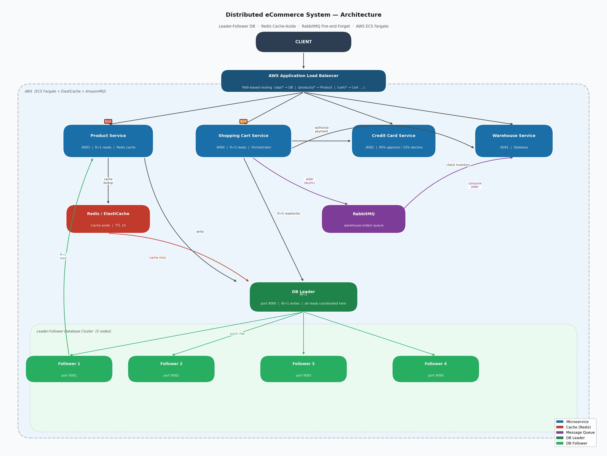

# Architecture Documentation

## Project Overview

Building a complete eCommerce system with:
- 4 Microservices (Product, Shopping Cart, Warehouse, Credit Card Provider)
- Distributed Database (Leader-Follower W=1, R=1/R=5 configurable)
- Redis Cache (ElastiCache for Product Service)
- AWS Deployment (ECS, Auto-scaling, ALB, ElastiCache)
- Load Testing (Locust)

---

## System Design Diagram



---

# Database Architecture Decision

## Executive Summary

**Choice:** Single Leader-Follower Cluster (W=1, R=1 or R=5 configurable, N=5)

We chose a single database cluster with 5 nodes using Leader-Follower architecture where writes go to 1 node (W=1) and reads use configurable strategies per microservice:
- **R=1**: Product Service uses single-node reads (fast, ~550ms median)
- **R=5**: Shopping Cart Service uses all-node reads (strong consistency, ~670ms median)

This provides fast writes for customer actions while allowing each microservice to optimize reads based on its workload (speed vs consistency trade-off).

## Use Cases Analysis

### Use Case 1: Add Item to Cart
- **Reads:** Product info (price, name, stock) from Product database (frequent)
- **Writes:** Create/update shopping cart (frequent)
- **Note:** Inventory availability checked via Product database stock field

### Use Case 2: Checkout
- **Reads:** Shopping cart contents, product details (frequent)
- **Writes:** Update cart status (frequent)
- **External Services:** Credit card authorization (90% approve, 10% decline)
- **External Services:** Warehouse ship request via RabbitMQ (always succeeds)

### Database Access Patterns

**Products:**
- **Pattern:** Read-heavy (customers browse constantly, admins update rarely)
- **Operations:** Read product details, check stock (frequent), Admin adds products (rare)
- **Read/Write Ratio:** ~10:1 (10,000 reads vs 100 writes in typical scenario)

**Shopping Carts:**
- **Pattern:** Write-heavy (create cart, add items, checkout)
- **Operations:** Create cart, update items, read contents (all frequent during sessions)
- **Read/Write Ratio:** ~1:5 (1 read vs 6 writes in typical customer session)

## Database Configuration

### Architecture Details
- **Type:** Leader-Follower
- **Nodes:** 5 (1 Leader + 4 Followers)
- **Write Strategy:** W=1 (write to Leader only)
- **Read Strategy:** Configurable per microservice
  - **R=1:** Product Service (fast, single-node reads)
  - **R=5:** Shopping Cart Service (strong consistency, all-node reads)
- **Scope:** Single cluster for both Products and Shopping Carts

### Data Storage
- **Products:** Stored as `"product_{id}" → {JSON with stock field}`
- **Shopping Carts:** Stored as `"cart_{id}" → {JSON}`
- **Capacity:** Sufficient for 1,000-5,000 products and active carts
- **Important:** Warehouse and Credit Card services have NO database storage (per assignment requirements)

## Why W=1, R=1/R=5?

### W=1 (Write to 1 node first)

**How it works:**
1. Customer clicks "Add to Cart"
2. Leader saves cart data immediately
3. Customer sees response (5ms under write-heavy load)
4. Leader replicates to 4 Followers in background (200ms each)

**Why this is good:**
- Fast customer experience (5ms vs 618ms for W=3, 2484ms for W=5 from Assignment 4)
- No waiting for replication
- Customer actions feel instant
- Critical for conversions

### R=5 (Read from all 5 nodes) - Shopping Cart Service

**How it works:**
1. Customer views cart or checks cart contents
2. System queries all 5 nodes in parallel
3. Returns the newest version (highest version number)

**Why this is good:**
- Always shows accurate cart contents
- Always shows correct totals during checkout
- Prevents showing stale cart data
- Zero stale reads (proven with 10,000 operations in load testing)
- Critical for checkout operations where consistency matters more than speed

### R=1 (Read from single node) - Product Service

**How it works:**
1. Customer browses products
2. System reads from single node (usually Leader)
3. Returns data immediately (fast response)

**Why this is good:**
- Much faster response time (~550ms vs ~670ms for R=5)
- Products don't change frequently, so slight staleness is acceptable
- Optimized for high-frequency product browsing
- Better user experience with faster page loads

## Configurable Read Strategies Per Microservice

### Implementation Overview

Each microservice can now configure its own read strategy based on its workload:

- **Product Service**: Uses **R=1** (fast, single node read)
  - Optimized for read-heavy product browsing
  - Median latency: ~550ms (includes service delay)
  - Database read: ~5-50ms
  
- **Shopping Cart Service**: Uses **R=5** (strong consistency, all nodes)
  - Optimized for write-heavy cart operations
  - Median latency: ~670ms (includes service delay)
  - Database read: ~200-300ms

### Database Layer Changes

1. **ReadCoordinator Service**: 
   - Added `readFromSingleNode(String key)` for R=1 strategy
   - Kept existing `readFromAllNodes(String key)` for R=5 strategy
   - Added `ReadStrategy` enum (R1, R5)

2. **LeaderController**:
   - Modified `/api/get` endpoint to accept `?readStrategy=R1` or `?readStrategy=R5`
   - Defaults to R=5 for backward compatibility

### Microservice Configuration

Each service configures its read strategy via `application.properties`:

**Product Service** (`microservices/product-service/src/main/resources/application.properties`):
```properties
database.readStrategy=R1
```

**Shopping Cart Service** (`microservices/shopping-cart-service/src/main/resources/application.properties`):
```properties
database.readStrategy=R5
```

### Performance Results

From load testing (Locust, 10 users, 60 seconds):

| Service | Strategy | Median Latency | Use Case |
|---------|----------|----------------|----------|
| Product Service | R=1 | 550ms | Product browsing (read-heavy) |
| Shopping Cart Service | R=5 | 670ms | Cart operations (consistency-critical) |

**Key Insight**: R=5 is ~22% slower than R=1, but provides strong consistency needed for cart operations. The trade-off is appropriate for each service's workload.

## Why Leader-Follower (Not Leaderless)?

### Advantages of Leader-Follower

**Simpler consistency model:**
- One Leader handles all writes
- Four Followers replicate from Leader
- Clear authority prevents write conflicts

**Prevents race conditions:**
- Two customers cannot modify the same cart simultaneously
- Shopping cart updates are serialized through Leader
- No conflict resolution needed

**Easier to debug:**
- Single source of truth (Leader)
- Clear replication flow
- Proven in load testing

### Why NOT Leaderless?

**From load testing:**
- W=N, R=1 Leaderless showed 1243ms writes at 90% write load (249x slower than W=1, R=5)
- 95% throughput degradation from read-heavy to write-heavy workloads
- Requires complex conflict resolution (vector clocks, CRDTs)
- Unnecessary for our scale (1,000 products)

## CAP Theorem Trade-offs

### What is CAP?
- **C**onsistency: All nodes see the same data at the same time
- **A**vailability: System responds to requests even if nodes fail
- **P**artition tolerance: System works even if network splits

**CAP Theorem:** You can only guarantee 2 out of 3

### Our Choice: AP (Availability + Partition Tolerance)

**What we prioritized:**
- **Availability:** Website stays up even if 1-2 nodes fail
- **Partition Tolerance:** System works during network issues
- **Speed:** Fast responses for customers

**What we deprioritized:**
- **Strong Consistency:** Accept brief stale data (up to 800ms)

### The Trade-off Explained

**What we gave up:**
- For about 0.8 seconds, Follower nodes might have slightly old data
- **Example:** Customer adds item to cart at 2:00:00 PM
    - Leader knows immediately (2:00:00 PM)
    - Follower 1 knows at 2:00:00.2 PM (200ms later)
    - Follower 2 knows at 2:00:00.4 PM (400ms later)
    - Follower 3 knows at 2:00:00.6 PM (600ms later)
    - Follower 4 knows at 2:00:00.8 PM (800ms later)
- After 0.8 seconds, ALL nodes have the same data

**Why this is acceptable:**
- 0.8 seconds is too fast for customers to notice
- Much better than website being down
- eCommerce prioritizes availability over brief staleness
- Our R=5 reads always return the newest version anyway (zero stale reads in Assignment 4)

## Performance Testing Results

From load testing W=1, R=5 across 10,000 operations:

**W=1 Write Performance by Workload:**

| Scenario | Write P50 | Write Avg | Throughput |
|----------|-----------|-----------|------------|
| 90% Write, 10% Read | **5ms** | 26ms | 106 req/s |
| 50% Write, 50% Read | 147ms | 135ms | 148 req/s |
| 10% Write, 90% Read | 268ms | 245ms | 326 req/s |
| 1% Write, 99% Read | 275ms | 273ms | 480 req/s |

**R=5 Read Performance by Workload:**

| Scenario | Read P50 | Read Avg |
|----------|----------|----------|
| 90% Write, 10% Read | **255ms** | 274ms |
| 50% Write, 50% Read | 412ms | 398ms |
| 10% Write, 90% Read | 532ms | 512ms |
| 1% Write, 99% Read | 542ms | 540ms |

**Critical Finding:**
- **Zero stale reads** across all 10,000 operations and all test scenarios
- R=5 always returns newest version by querying all nodes and comparing version numbers
- Even during 800ms replication window, R=5 finds latest data on Leader

### Comparison with Other Strategies

**Write Performance at 90% Write Load:**

| Strategy | Write P50 | Performance vs W=1, R=5 |
|----------|-----------|-------------------------|
| **W=1, R=5** | **5ms** | Baseline (fastest) |
| W=3, R=3 | 618ms | 123x slower |
| W=5, R=1 | 2484ms | 497x slower |
| W=N, R=1 | 1243ms | 249x slower |

**Why This Matters:**
- eCommerce requires fast writes for cart operations
- W=1, R=5 delivered best write performance under write-heavy load
- All configurations achieved zero stale reads, so performance was the deciding factor

### Key Insights

1. **W=1 provides best write performance** - 5ms at 90% write load vs 618ms+ for alternatives
2. **R=5 eliminates stale reads** - Zero stale reads despite async replication
3. **Leader-Follower handled 10,000 operations** - No failures or data loss
4. **Replication delays are predictable** - 200ms per node, total 800ms
5. **Consistent performance** - W=1, R=5 maintained stable throughput across workloads

## Why NOT Other Database Options?

### W=5, R=1 (Write to all 5, Read from 1)
**Why NOT:** 2484ms writes at 90% write load (497x slower than W=1, R=5). Unacceptable for customer cart operations.

### W=3, R=3 (Write to 3, Read from 3)
**Why NOT:** 618ms writes vs 5ms (W=1, R=5) at high write loads. No advantage for our workload. Same throughput but much slower writes.

### W=N, R=1 Leaderless
**Why NOT:**
- 1243ms writes (249x slower than W=1, R=5)
- 95% throughput collapse from read-heavy to write-heavy workloads
- Excessive complexity (conflict resolution) unnecessary for our scale

## Traffic Patterns & Assumptions

### Use Case Frequency

**Adding items to cart: Very Common (~85% of traffic)**

People browse a lot before buying. A typical customer might:
- Look at 20 products
- Add 5 items to their cart
- Maybe checkout (or maybe abandon the cart)

**Checkout: Less Common (~15% of traffic)**

Most carts get abandoned. Industry average is 60-70% abandonment rate. Checkout requires payment info and commitment, so it happens way less often than browsing.

**Our estimate: 10-15 add-to-cart operations for every 1 checkout**

### Traffic Patterns
- **Browse : Add : Checkout** = roughly **20 : 10 : 1**
- Peak load: ~1,000 concurrent shoppers
- Most carts (60-70%) get abandoned without checkout

### Data Patterns
- Starting with 1,000 products in the catalog
- Average cart has 3-5 items
- Carts only last for one session (no saving for later)

### Performance Assumptions
- Each request has a random 100-1000ms delay (to trigger autoscaling in testing)
- Database replication takes ~200ms
- This delay is acceptable for our business logic

### Simplifications (for this assignment)
- No user authentication (we trust the customer_id from the client)
- Products use simple auto-incrementing IDs
- Quantity limits: 1-10,000 items per product

## System Scale

### Current Scale
- **Products:** 1,000-5,000 items in database
- **Concurrent Users:** Up to 1,000 simultaneous shoppers
- **Peak Load:** Auto-scaling enabled for traffic spikes

### Usage Patterns
- **Browse/Search:** High frequency (product reads from database)
- **Add to Cart:** High frequency (cart writes + product reads)
- **Checkout:** Lower frequency (cart reads/writes + external service calls)
- **Note:** Warehouse service only involved in checkout (ship via RabbitMQ)

### Business Requirements
- **Availability > Consistency:** Website uptime is critical
- **Fast Response:** Customers expect instant actions
- **Accurate Data:** Must prevent overselling and wrong prices

## Future Scaling Plan

### Current Architecture (1,000 products)
- Single cluster sufficient
- All data fits in memory
- 5 nodes handle load easily

### Growth Plan (10,000+ products)
**Option 1: Vertical Scaling**
- Increase memory on existing nodes
- Add more CPU resources
- Simple, low-risk approach

**Option 2: Horizontal Partitioning**
- Split into two clusters:
    - **Cluster 1:** Products (W=1, R=5) - Read-optimized
    - **Cluster 2:** Shopping Carts (W=5, R=1) - Write-optimized
- Each cluster optimized for its workload

**Option 3: Geographic Distribution**
- Consider Leaderless for global deployment
- Multi-region replication for low latency worldwide
- Only if expanding internationally

---

## Infrastructure Scaling Strategy

### Resource Allocation

The system is deployed on AWS ECS Fargate with the following resource configuration:

| Resource | Baseline | Scaled | Change |
|----------|----------|--------|--------|
| **CPU per Task** | 0.25 vCPU (256 units) | 1 vCPU (1024 units) | 4x |
| **Memory per Task** | 512 MB | 2 GB (2048 MB) | 4x |
| **Max Instances** | 3 per service | 10 per service | 3.3x |

### Auto-Scaling Configuration

- **Scaling Metric**: Memory utilization (ECSServiceAverageMemoryUtilization)
- **Target Threshold**: 40% memory utilization
- **Min Capacity**: 1 instance per service
- **Max Capacity**: 10 instances per service
- **Cooldown**: 60 seconds (scale-out and scale-in)

### Why Memory-Based Scaling?

All services use memory-based scaling because:
- Services use I/O-bound operations with `Thread.sleep()` delays
- Memory pressure from connection pools indicates actual request load
- CPU utilization doesn't accurately reflect load for I/O-bound services
- Uniform 40% threshold ensures coordinated scaling across all services

### Performance Results

Load testing shows the system handles:
- **272 RPS** with 99.5% success rate
- **Single instance capacity**: 272 RPS (with 1 vCPU / 2 GB configuration)
- **Theoretical max capacity**: ~10,880 RPS (4 services × 10 instances × 272 RPS)
- **Average response time**: 946ms under load

See `terraform/README.md` for full AWS deployment and performance analysis.

---

## Conclusion

Our W=1, configurable R=1/R=5 Leader-Follower architecture provides the optimal balance for an eCommerce system:

- **Fast writes** (5ms at 90% write load from Assignment 4)  
- **Configurable read strategies** per microservice:
  - **R=1** for Product Service (fast, ~550ms median)
  - **R=5** for Shopping Cart Service (strong consistency, ~670ms median)
- **Zero stale reads** with R=5 across 10,000 operations  
- **High availability** ensures website stays up  
- **Proven reliability** from Assignment 4 testing  
- **Simple to maintain** and debug

Each microservice is optimized for its workload:
- Product Service prioritizes speed (R=1) for high-frequency browsing
- Shopping Cart Service prioritizes consistency (R=5) for critical cart operations

The brief 800ms eventual consistency window is acceptable for our use case and vastly outweighed by the benefits of speed and availability.

Our system is optimized for what actually happens in eCommerce:
- **Lots of browsing** (handled well by **R=1** fast single-node reads for Product Service)
- **Lots of cart modifications** (handled well by W=1 fast writes)
- **Some checkouts** (**R=5** ensures we read the latest cart data from all nodes)

The W=1, configurable R=1/R=5 strategy gives us:
- **Fast writes** when we need them (cart operations) - W=1
- **Fast reads** for product browsing - R=1 (~550ms median)
- **Strong consistency** for cart operations - R=5 (~670ms median)
- Each microservice optimized for its workload (speed vs consistency trade-off)
